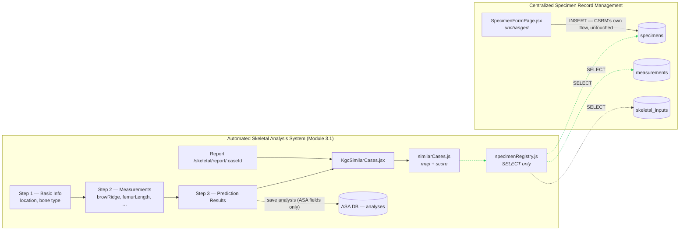

# Similar Cases — ASA ⇄ CSRM Integration

> How the **Automated Skeletal Analysis System** (ASA, Module 3.1 — IT22299802)
> populates its **Similar Cases** panel from the **Centralized Specimen Record
> Management** system (CSRM), without modifying either system.

| | |
|---|---|
| **Consumer** | Automated Skeletal Analysis System (ASA) — `/skeletal/**` |
| **Provider** | Centralized Specimen Record Management (CSRM) — `/specimens/**` |
| **Direction** | CSRM → ASA, **read-only, one-way** |
| **CSRM tables read** | `specimens`, `measurements`, `skeletal_inputs` |
| **CSRM tables written** | *none* |
| **ASA schema change** | *none* |
| **Integration style** | Data-contract coupling (table + column names), not code coupling |

---

## 1. What changed, and what deliberately did not

Before this work, the Similar Cases panel was hard-coded demo data (`C089` /
`C102`, "Texas" / "Nevada"). It is now populated live from the CSRM catalogue,
matched to the analysis type and measurements the analyst actually entered.

### 1.1 Files added (all ASA-side)

| File | Role |
|---|---|
| [src/lib/specimenRegistry.js](src/lib/specimenRegistry.js) | Read-only data-access layer. The **only** place CSRM table/column names appear. |
| [src/lib/similarCases.js](src/lib/similarCases.js) | Mapping + scoring engine. Pure functions, no I/O beyond the registry. |
| [src/components/KgcSimilarCases.jsx](src/components/KgcSimilarCases.jsx) | The panel itself — loading / empty / error / results states. |
| [src/components/KgcSimilarCaseDetail.jsx](src/components/KgcSimilarCaseDetail.jsx) | The **View** popup: one matched specimen's full catalogue record, its measurements, its morphology and the per-channel evidence behind the score. Renders from data the panel already holds — see §5. |

### 1.2 Files modified (all ASA-side, presentation only)

| File | Change |
|---|---|
| [src/pages/NewAnalysis/KgcStep3Review.jsx](src/pages/NewAnalysis/KgcStep3Review.jsx) | Removed the `mockCases` array; renders `<KgcSimilarCases />`. |
| [src/pages/KgcReport.jsx](src/pages/KgcReport.jsx) | Removed the `mockSimilarCasesData` array; renders `<KgcSimilarCases compact />`. |

### 1.3 Non-modification guarantees

**CSRM is untouched.** No CSRM source file is imported, edited, re-exported or
wrapped, and no CSRM SQL object is created or altered:

- `src/pages/SpecimenFormPage.jsx` — unchanged
- `src/pages/SpecimenListPage.jsx` — unchanged
- `src/pages/MinuriModulePage.jsx` — unchanged
- `src/supabase.js` — unchanged
- No table, column, view, index, trigger, constraint or RLS policy added or altered
- No migration script introduced

Every statement this integration issues is a `SELECT` (PostgREST `GET`). There
is no `insert` / `update` / `upsert` / `delete` / `rpc` anywhere in the three new
files — verifiable with:

```bash
grep -nE "\.(insert|update|upsert|delete|rpc)\(" \
  src/lib/specimenRegistry.js src/lib/similarCases.js \
  src/components/KgcSimilarCases.jsx src/components/KgcSimilarCaseDetail.jsx
# (no output)
```

**ASA's own attributes and backend are untouched.** The Step-1 and Step-2 forms,
the `computePredictions()` rule set, `AnalysisContext`, `analysisStore.js` and
the `analyses` table all keep exactly their existing shape. Nothing read from
CSRM is written back into an ASA record — matched cases are **derived at view
time and discarded**. A saved analysis contains precisely the same fields it did
before this integration.

---

## 2. Architecture



The dashed green edges are the entire integration surface: three read queries.
Nothing flows back from ASA into CSRM.

### 2.1 Connection

CSRM lives in the shared OAHRIS Supabase project; ASA keeps its own project
(`analyses`, `course_progress`, Google auth). `specimenRegistry.js` therefore
creates its **own read-only client** for the CSRM project rather than importing
`src/supabase.js` — so a mis-configured shared client can never break the ASA
module, and CSRM code stays untouched.

Configuration falls back in this order:

```
VITE_CSRM_SUPABASE_URL  →  VITE_SUPABASE_URL  →  built-in default
VITE_CSRM_SUPABASE_ANON_KEY → VITE_SUPABASE_ANON_KEY → built-in default
```

The `anon` key is used, so CSRM's Row-Level Security continues to govern exactly
what is visible. The integration cannot see more than any other anonymous
reader, and gains no privilege of its own.

---

## 3. The mapping problem

The two systems describe bone at different granularities and with different
vocabularies, and neither may be changed:

| | ASA | CSRM |
|---|---|---|
| **Granularity** | 6 analysis groups | element-level anatomy |
| **Values** | Skull, Pelvis, Upper Limb, Lower Limb, Thorax, Teeth | Skull, Mandible, Maxilla, Molar, Premolar, Humerus, Patella, Calcaneus, Talus, Metatarsal, Phalanx, Skeleton Assemblage, … |
| **Feature vocabulary** | closed, hyphenated slugs (`moderate-closure`) | free text (`Moderately Closed`) |
| **Units** | always millimetres | free `unit` column (`mm`, `cm`, `count`) |

Three lookup tables in `similarCases.js` bridge that gap. **They are the whole
contract** — if CSRM ever renames a column, only these tables change.

### 3.1 `ANALYSIS_BONE_MAP` — analysis type ⇄ `specimens.bone_type`

Each ASA analysis type declares the CSRM elements that **belong** to it
(`primary`) and those that only **may** belong to it (`secondary` — an
unqualified "Phalanx" could be hand or foot; a "Skeleton Assemblage" contains
everything). This is the gate: a specimen in neither list is never a candidate.

| ASA analysis type | `primary` CSRM `bone_type` tokens | `secondary` |
|---|---|---|
| **Skull** | skull, cranium, crania, calvaria, frontal, parietal, occipital, temporal, mandible, maxilla, zygomatic | skeleton assemblage |
| **Pelvis** | pelvis, pelvic, ilium, ischium, pubis, innominate, coxal, sacrum | skeleton assemblage |
| **Upper Limb** | humerus, radius, ulna, scapula, clavicle, metacarpal, carpal | phalanx, skeleton assemblage |
| **Lower Limb** | femur, tibia, fibula, patella, calcaneus, calcaneum, talus, astragalus, metatarsal, tarsal | phalanx, skeleton assemblage |
| **Thorax** | rib, sternum, costal, vertebra, thoracic | skeleton assemblage |
| **Teeth** | molar, premolar, incisor, canine, tooth, teeth, dentition, dental | mandible, maxilla, skeleton assemblage |

Tokens are matched case-insensitively as substrings, so CSRM may add
`Molar 1st (Upper)` or `Mandible (Left)` — both still resolve without any change
here.

**Verified coverage** — every `bone_type` currently in the catalogue resolves:

```
Premolar   -> Teeth          Skull      -> Skull         Mandible   -> Skull, Teeth*
Calcaneus  -> Lower Limb     Patella    -> Lower Limb    Molar      -> Teeth
Maxilla    -> Skull, Teeth*  Talus      -> Lower Limb    Metatarsal -> Lower Limb
Humerus    -> Upper Limb     Phalanx    -> Upper Limb*, Lower Limb*
Skeleton Assemblage -> all six groups*                   (* = secondary tier)
```

### 3.2 `FEATURE_MAP` — ASA Step-2 field ⇄ `skeletal_inputs` column

`skeletal_inputs` is CSRM's morphological (non-metric) observation table, and it
lines up field-for-field with what ASA Step 2 asks the analyst for:

| ASA analysis type | ASA field | `skeletal_inputs` column | Comparison |
|---|---|---|---|
| Skull | `browRidge` | `skull_brow_ridge` | ordinal, 5 levels |
| Skull | `mastoidSize` | `mastoid_process_size` | ordinal, 3 levels |
| Skull | `jawShape` | `jaw_shape` | nominal |
| Skull | `cranialSuture` | `cranial_suture_status` | ordinal, 5 levels |
| Pelvis | `subpubicAngle` | `subpubic_angle` | ordinal, 2 levels |
| Pelvis | `sciaticNotch` | `sciatic_notch_width` | ordinal, 2 levels |
| Pelvis | `pubicSymphysis` | `pubic_symphysis_stage` | ordinal, 4 levels |
| Upper Limb | `humerusLength` | `humerus_length` | numeric |
| Upper Limb | `boneRobusticity` | `upper_limb_robusticity` | ordinal, 2 levels |
| Lower Limb | `femurLength` | `femur_length` | numeric |
| Lower Limb | `femurHeadDiameter` | `femur_head_diameter` | numeric |
| Lower Limb | `growthPlate` | `growth_plate` | ordinal, 3 levels |
| Thorax | `ribShape` | `rib_shape` | ordinal, 3 levels |
| Thorax | `sternumLength` | `sternum_length` | numeric |
| Teeth | `teethType` | `teeth_type` | nominal |
| Teeth | `dentalWear` | `dental_wear` | ordinal, 4 levels |
| Teeth | `eruptionStage` | `tooth_eruption_stage` | ordinal, 3 levels |

**Vocabulary bridging.** ASA values come from a closed option list and are mapped
by exact lookup. CSRM values are free text, so each level carries keyword
aliases and the CSRM string is placed on the same scale by substring match:

| ASA value | scale level | CSRM values that land on the same level |
|---|---|---|
| `moderate-closure` | 2 of 4 | "Moderately Closed", "Partial Closure", "Moderate" |
| `less-25mm` | 0 of 2 | "Small", "less than 25", "under 25", "gracile" |
| `v-shaped` | nominal *v* | "V-shaped", "V shape" |

Ordinal comparison gives **partial credit for near misses**
(`1 − |levelA − levelB| / (levels − 1)`), so *Moderate* vs *Prominent* scores
0.75 rather than 0. Nominal comparison is exact-match only. If a CSRM value
matches no alias, that field is **skipped** rather than guessed at.

### 3.3 `METRIC_MAP` — ASA numeric field ⇄ `measurements` rows

| ASA field | `measurements.bone_type` | `measurements.measurement_type` (like-for-like) | skipped as fragmentary |
|---|---|---|---|
| `femurLength` | femur | Maximum Length, Max Length, Length | Preserved Length, Fragment Length |
| `femurHeadDiameter` | femur | Head Diameter, Maximum Diameter, Minimum Diameter | — |
| `humerusLength` | humerus | Maximum Length, Max Length, Length | Preserved Length, Fragment Length |
| `sternumLength` | sternum | Maximum Length, Maximum Height, Length | Preserved Length, Fragment Length |

Two details matter here:

- **Units.** `measurements.unit` is free text; values are normalised to
  millimetres (`mm` ×1, `cm` ×10, `m` ×1000). An unrecognised unit — CSRM uses
  `count` for "Recorded Elements" — marks the row **not comparable** rather than
  being read as a length.
- **Fragmentary material.** Most CSRM limb records are
  *"Maximum Preserved Length"*, which is a **lower bound** on the true bone
  length, not the bone length. Scoring a complete-bone ASA figure against it
  would penalise a specimen simply for being fragmentary, so such rows are
  skipped and the specimen loses the metric channel instead. (In the current
  catalogue every one of the 8 humerus records is fragmentary — 50.6 mm to
  148.2 mm — so this rule is load-bearing, not hypothetical.)

---

## 4. Scoring

Five independent evidence channels, each producing a score in `0‥1`. A channel
with no data for a given pair is **dropped and its weight redistributed**, so a
sparsely-recorded specimen is never punished for what CSRM simply did not record:

$$\text{match \%} = \frac{\sum_i w_i \cdot s_i}{\sum_i w_i} \times 100 \quad \text{over available channels}$$

| Channel | Weight | Source | Available when |
|---|---|---|---|
| `boneGroup` | 0.40 | `specimens.bone_type` ⇄ analysis type | always (it is the gate) |
| `features` | 0.25 | `skeletal_inputs.*` ⇄ Step-2 selections | ≥ 1 comparable field on both sides |
| `metrics` | 0.15 | `measurements.value` ⇄ Step-2 numbers | ≥ 1 like-for-like measurement |
| `provenance` | 0.10 | `specimens.district` / `site_name` / `province` ⇄ `basicInfo.location` | analyst entered a location |
| `profile` | 0.10 | `specimens.sex_estimate` / `age_estimate` ⇄ ASA predictions | CSRM value is not `Unknown` |

Channel details:

- **boneGroup** — `primary` scores 1.0, `secondary` 0.55.
- **features** — mean over comparable fields. If a specimen carries more than
  one `skeletal_inputs` row, the best-scoring row wins.
- **metrics** — relative-distance credit: identical ⇒ 1, 20 % away ⇒ 0.
- **provenance** — district 1.0, site 0.9, province 0.6, otherwise 0.
- **profile** — sex equality, plus age-band overlap. Bands are parsed from both
  vocabularies (`"18 - 25"`, `"40+"`, `"< 18"`, `"Adult"`, `"Unknown"`). A CSRM
  `Unknown` sex or an ASA `Indeterminate` sex is *ignored*, not scored zero.

Results below **35 %** are hidden; the top **5** are shown, sorted by match, then
by number of evidence channels, then primary tier over secondary, then most
recent excavation. Each row's `title` tooltip explains why it matched.

---

## 5. Query flow

Three queries per panel render — no N+1:

```
1. SELECT … FROM specimens
     WHERE bone_type ILIKE ANY(<tokens for this analysis type>)
     ORDER BY created_at DESC LIMIT 300
2. SELECT … FROM measurements     WHERE specimen_id IN (<ids from 1>)
3. SELECT … FROM skeletal_inputs  WHERE specimen_id IN (<ids from 1>)
```

Steps 2 and 3 run concurrently. Scoring is then pure in-memory work.

**The "View" popup adds no fourth query.** Those three reads already return
everything a detail view needs, so `scoreSpecimen()` attaches the rows it just
used to the case it returns:

```js
source: { specimen, measurements: measurementRows, skeletalInputs: inputRows }
```

`KgcSimilarCaseDetail` renders straight off that object. Opening, closing and
reopening a case is pure presentation over data the page is already holding —
the read path above is unchanged, and a case can still be inspected after CSRM
has gone offline.

### 5.1 Failure behaviour

The panel is strictly additive — CSRM being unavailable never blocks an
analysis:

| Situation | Behaviour |
|---|---|
| CSRM unreachable / bad key | Amber "Specimen catalogue unavailable" message; wizard and report unaffected |
| `measurements` or `skeletal_inputs` unreadable (e.g. RLS) | Non-fatal — those channels drop, matching continues on the rest |
| No specimen clears 35 % | "No comparable specimens found" empty state |
| Analysis type not in the map | Empty state, no query issued |

---

## 6. Worked example

Analyst enters a **Skull** analysis at **Vavuniya** — brow ridge *Moderate*,
mastoid *25–30 mm*, jaw *V-shaped*, cranial suture *Moderate Closure*.

`SPEC-521` in CSRM holds `bone_type = 'Skull'`, `district = 'Vavuniya'`, and a
`skeletal_inputs` row reading *Moderate* / *V-shaped* / *Moderately Closed*:

| channel | score | why |
|---|---|---|
| boneGroup | 100 | `Skull` is a primary Skull element |
| features | 100 | 3 of 3 comparable features agree across the two vocabularies |
| provenance | 100 | district `Vavuniya` = entered location |
| metrics | *dropped* | no comparable numeric field in a skull analysis |
| profile | *dropped* | `sex_estimate` / `age_estimate` not recorded |

→ **(0.40 + 0.25 + 0.10) / 0.75 = 100 % match**, top of the panel.

A `Mandible` from another district with only a recorded age band scores 83 %
(bone group 100, provenance 0, profile 100 over weights 0.40/0.10/0.10) — still
a legitimate Skull comparison, ranked below the exact one.

---

## 7. Verification

| Check | Result |
|---|---|
| Unit tests over the scoring engine (29 assertions) | ✅ 29 passed, 0 failed |
| `bone_type` coverage — every catalogue value maps to ≥ 1 analysis type | ✅ 12 / 12 |
| Live end-to-end run for all 6 analysis types against 102 specimens / 102 measurements / `skeletal_inputs` | ✅ Sensible, ranked results |
| Vocabulary bridging (`moderate-closure` ⇄ "Moderately Closed", `less-25mm` ⇄ "Small") | ✅ |
| Unit conversion (`cm` → `mm`) and rejection of `count` | ✅ |
| Fragmentary "Maximum Preserved Length" excluded from metric scoring | ✅ |
| Weight redistribution (bone-group-only ⇒ 100 %, not 40 %) | ✅ |
| ESLint on new/changed non-component files | ✅ Clean |
| Production build (`vite build`) | ✅ Passes |
| CSRM files unmodified (`git status`) | ✅ Clean |
| No write operation in the integration | ✅ Confirmed by grep |

Coverage note: `skeletal_inputs` currently holds **one** row for the whole
catalogue, so the `features` channel is exercised by unit tests and by that
single specimen (`SPEC-521`) rather than at scale. As CSRM analysts record more
morphology, matches sharpen automatically — no ASA change required.

---

## 8. Extending the integration

| To do this | Change only this |
|---|---|
| CSRM adds a bone type (e.g. `Femur`, `Rib`) | Nothing — the token lists already cover them |
| CSRM renames a column | The matching entry in `FEATURE_MAP` / `METRIC_MAP` / `CSRM_COLUMNS` |
| CSRM uses new wording for a feature value | Add the alias to that feature's `levels` array |
| Re-weight the evidence channels | `CHANNEL_WEIGHTS` |
| Show more/fewer rows, or change the cut-off | `MAX_RESULTS` / `MIN_MATCH` |
| Add a new ASA analysis type | One entry in `ANALYSIS_BONE_MAP` + one in `FEATURE_MAP` |

Adding a channel means adding one `score*()` function and one entry in the
`channels` array in `scoreSpecimen()` — the weight-redistribution maths needs no
change.

---

*OAHRIS · R26-ISE-006 · Automated Skeletal Analysis System (Module 3.1) —
Chamudi Gayeshika, IT22299802*
