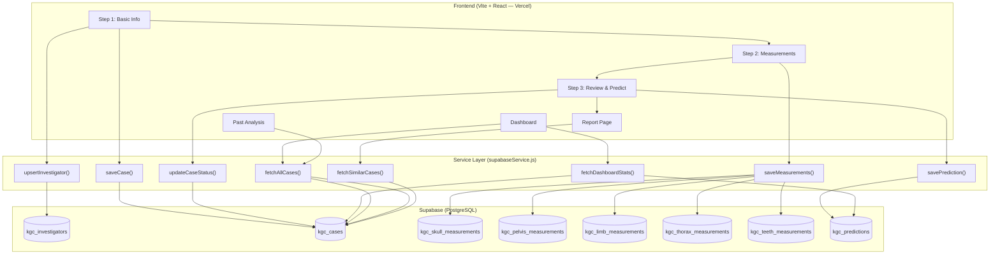
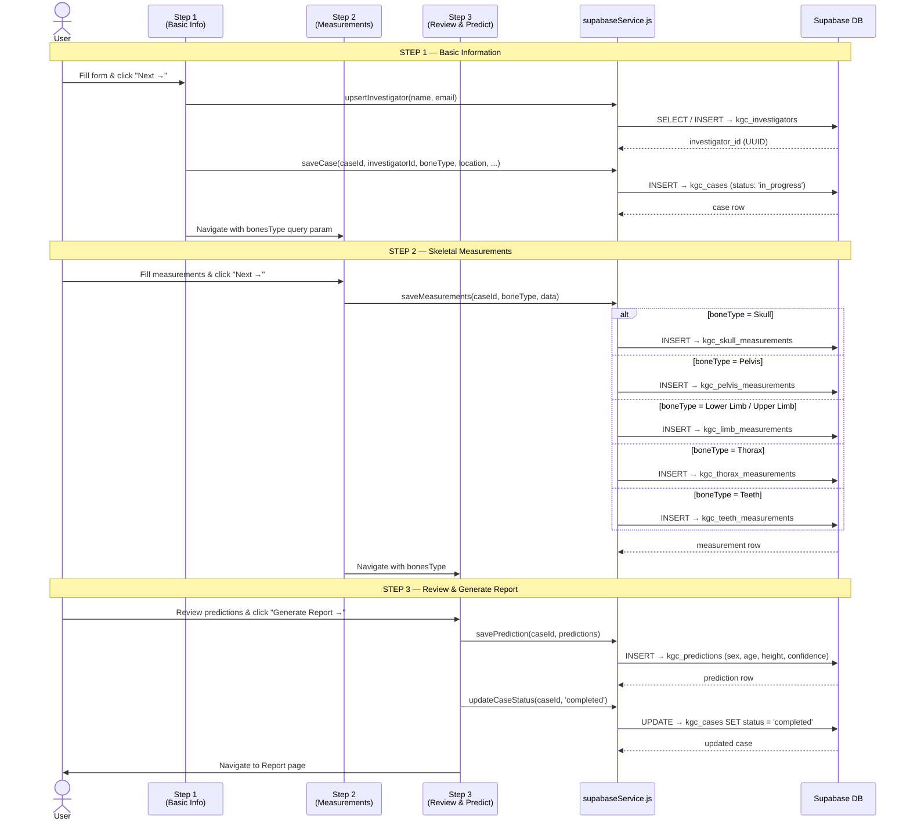
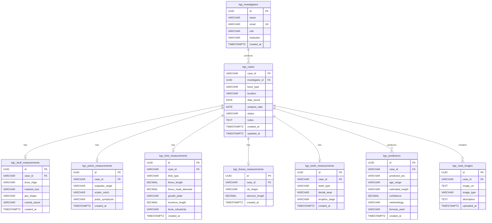

# OAHRIS — Skeletal Analysis Module: Supabase Integration Plan

> **Module Owner:** Chamudi (IT22299802)  
> **Module:** Automated Skeletal Analysis (KGC)  
> **Date:** May 2026  
> **Frontend:** Vite + React (hosted on Vercel)  
> **Backend:** Supabase (PostgreSQL)

---

## 1. Overview

This document describes how the **Automated Skeletal Analysis** frontend connects to the **Supabase** database to persist all analysis data. The system follows a 3-step wizard flow where each step saves data to the relevant database tables in real time.

---

## 2. System Architecture



---

## 3. Data Flow — Sequence Diagram

This diagram shows exactly what happens when a user completes a full analysis:



---

## 4. Entity Relationship Diagram



---

## 5. Table-to-Step Mapping

| Analysis Step | Frontend Component | Service Function | Database Table | Operation |
|---|---|---|---|---|
| Step 1 — Basic Info | `KgcStep1BasicInfo.jsx` | `upsertInvestigator()` | `kgc_investigators` | Find or Create |
| Step 1 — Basic Info | `KgcStep1BasicInfo.jsx` | `saveCase()` | `kgc_cases` | INSERT (status: `in_progress`) |
| Step 2 — Skull | `KgcStep2Measurements.jsx` | `saveMeasurements()` | `kgc_skull_measurements` | INSERT |
| Step 2 — Pelvis | `KgcStep2Measurements.jsx` | `saveMeasurements()` | `kgc_pelvis_measurements` | INSERT |
| Step 2 — Lower Limb | `KgcStep2Measurements.jsx` | `saveMeasurements()` | `kgc_limb_measurements` | INSERT (limb_type: `lower`) |
| Step 2 — Upper Limb | `KgcStep2Measurements.jsx` | `saveMeasurements()` | `kgc_limb_measurements` | INSERT (limb_type: `upper`) |
| Step 2 — Thorax | `KgcStep2Measurements.jsx` | `saveMeasurements()` | `kgc_thorax_measurements` | INSERT |
| Step 2 — Teeth | `KgcStep2Measurements.jsx` | `saveMeasurements()` | `kgc_teeth_measurements` | INSERT |
| Step 3 — Predict | `KgcStep3Review.jsx` | `savePrediction()` | `kgc_predictions` | INSERT |
| Step 3 — Complete | `KgcStep3Review.jsx` | `updateCaseStatus()` | `kgc_cases` | UPDATE (status: `completed`) |
| Dashboard | `KgcDashboard.jsx` | `fetchDashboardStats()` | `kgc_cases`, `kgc_predictions` | SELECT + aggregate |
| Past Analysis | `KgcPastAnalysis.jsx` | `fetchAllCases()` | `kgc_cases` | SELECT |
| Report | `KgcReport.jsx` | `fetchSimilarCases()` | `kgc_cases` | SELECT (by bone_type) |

---

## 6. Field Mapping — Frontend ↔ Database

### Step 1: Basic Info → `kgc_cases`

| Frontend Field (camelCase) | Database Column (snake_case) | Type |
|---|---|---|
| `currentCaseId` | `case_id` | VARCHAR(20) PK |
| *(from investigator)* | `investigator_id` | UUID FK |
| `bonesType` | `bone_type` | VARCHAR(20) |
| `location` | `location` | VARCHAR(200) |
| `dateFound` | `date_found` | DATE |
| `analysisDate` | `analysis_date` | DATE |
| *(auto)* | `status` | VARCHAR(20) — `in_progress` |

### Step 2: Skull → `kgc_skull_measurements`

| Frontend Field | Database Column | Values |
|---|---|---|
| `browRidge` | `brow_ridge` | smooth, less-developed, moderate, prominent, thick |
| `mastoidSize` | `mastoid_size` | less-25mm, 25-30mm, more-30mm |
| `jawShape` | `jaw_shape` | u-shaped, v-shaped, robust, rounded |
| `cranialSuture` | `cranial_suture` | open, partially-open, moderate-closure, mostly-closed, completely-closed |

### Step 2: Pelvis → `kgc_pelvis_measurements`

| Frontend Field | Database Column | Values |
|---|---|---|
| `subpubicAngle` | `subpubic_angle` | wide, narrow |
| `sciaticNotch` | `sciatic_notch` | wide, narrow |
| `pubicSymphysis` | `pubic_symphysis` | smooth-flat, moderate-flat-ridges, rough-granular, degenerated-eroded |

### Step 2: Lower Limb → `kgc_limb_measurements`

| Frontend Field | Database Column | Type |
|---|---|---|
| *(auto)* | `limb_type` | `'lower'` |
| `femurLength` | `femur_length` | DECIMAL(6,1) mm |
| `femurHeadDiameter` | `femur_head_diameter` | DECIMAL(5,1) mm |
| `growthPlate` | `growth_plate` | fused, partially-fused, unfused |

### Step 2: Upper Limb → `kgc_limb_measurements`

| Frontend Field | Database Column | Type |
|---|---|---|
| *(auto)* | `limb_type` | `'upper'` |
| `humerusLength` | `humerus_length` | DECIMAL(6,1) mm |
| `boneRobusticity` | `bone_robusticity` | robust, gracile |

### Step 2: Thorax → `kgc_thorax_measurements`

| Frontend Field | Database Column | Type |
|---|---|---|
| `ribShape` | `rib_shape` | smooth, scalloped, irregular |
| `sternumLength` | `sternum_length` | DECIMAL(5,1) mm |

### Step 2: Teeth → `kgc_teeth_measurements`

| Frontend Field | Database Column | Values |
|---|---|---|
| `teethType` | `teeth_type` | deciduous, permanent, mixed |
| `dentalWear` | `dental_wear` | none, mild, moderate, severe |
| `eruptionStage` | `eruption_stage` | early, partial, complete |

### Step 3: Predictions → `kgc_predictions`

| Frontend Field | Database Column | Notes |
|---|---|---|
| `gender` | `predicted_sex` | Male, Female, Indeterminate |
| `ageRange` | `age_range` | e.g. "18 - 25", "35 - 45" |
| `height` | `estimated_height` | e.g. "169.3 cm" or "Unknown" |
| `confidence` | `confidence` | DECIMAL — % stripped (e.g. 94.0) |
| *(auto)* | `methodology` | `'Bass 2005'` |

---

## 7. Connection Setup

### Framework
- **Vite + React** (NOT Next.js)
- **Client library:** `@supabase/supabase-js` v2
- **No SSR needed** — `@supabase/ssr` is NOT required

### Environment Variables (`.env.local`)

```env
VITE_SUPABASE_URL=https://siyqkcnnicsdnztquahf.supabase.co
VITE_SUPABASE_ANON_KEY=<your-anon-key>
```

### Supabase Client (`src/supabase.js`)

```javascript
import { createClient } from '@supabase/supabase-js'

const supabaseUrl = import.meta.env.VITE_SUPABASE_URL
const supabaseKey = import.meta.env.VITE_SUPABASE_ANON_KEY

export const supabase = createClient(supabaseUrl, supabaseKey)
```

---

## 8. Security — Row Level Security (RLS)

Since the app does **not** have user authentication, all requests use the Supabase **anon** key. Anon RLS policies must be enabled on all `kgc_*` tables:

```sql
-- SELECT (read) for all tables
CREATE POLICY "kgc_anon_select_cases" ON kgc_cases FOR SELECT TO anon USING (true);
-- ... (repeat for all 9 tables)

-- INSERT (write) for all tables
CREATE POLICY "kgc_anon_insert_cases" ON kgc_cases FOR INSERT TO anon WITH CHECK (true);
-- ... (repeat for all 9 tables)

-- UPDATE for kgc_cases (status changes)
CREATE POLICY "kgc_anon_update_cases" ON kgc_cases FOR UPDATE TO anon USING (true) WITH CHECK (true);
```

---

## 9. Project File Structure

```
vercel_chamudi/
├── .env.local                          ← Supabase credentials
├── src/
│   ├── supabase.js                     ← Supabase client
│   ├── services/
│   │   └── supabaseService.js          ← All DB operations (NEW)
│   ├── context/
│   │   └── AnalysisContext.jsx         ← React state (in-memory)
│   ├── pages/
│   │   ├── NewAnalysis/
│   │   │   ├── KgcStep1BasicInfo.jsx   ← Saves case + investigator
│   │   │   ├── KgcStep2Measurements.jsx← Saves measurements
│   │   │   └── KgcStep3Review.jsx      ← Saves predictions
│   │   ├── KgcDashboard.jsx            ← Live stats from DB
│   │   ├── KgcPastAnalysis.jsx         ← All cases from DB
│   │   └── KgcReport.jsx              ← Similar cases from DB
│   └── ...
├── kgc_database_schema.sql             ← SQL schema
└── package.json
```

---

## 10. Deployment Checklist

- [x] Tables created in Supabase (via `kgc_database_schema.sql`)
- [x] Anon RLS policies added
- [x] `@supabase/supabase-js` installed
- [x] `supabaseService.js` created with all DB operations
- [x] Step 1/2/3 save data on form submit
- [x] Dashboard reads live statistics
- [x] Past Analysis reads all cases
- [x] Build passes (0 errors)
- [x] Browser test passed — full flow verified
- [ ] Set env vars in Vercel Dashboard
- [ ] Push to Git → auto-deploy

---

*Generated: May 2026 | OAHRIS Skeletal Analysis Module*
