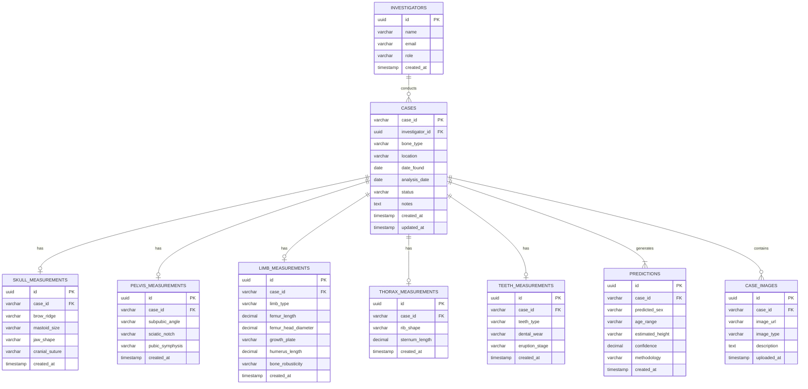
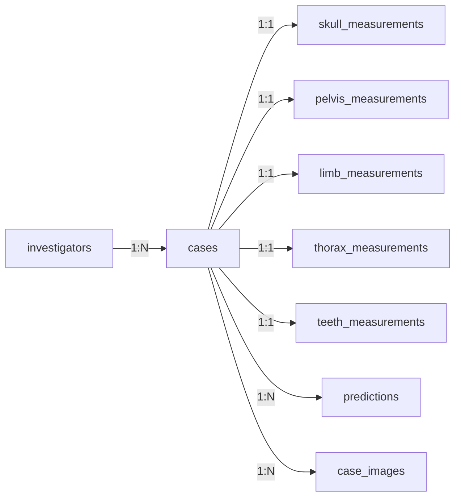

# OAHRIS — Database Design Document

## Automated Skeletal Analysis System — Relational Database Schema

---

**Version:** 1.0 | **Date:** May 2026
**Target Platform:** Supabase (PostgreSQL)
**Project:** OAHRIS — Osteoarchaeological Human Remains Identification System

---

## 1. Entity-Relationship Diagram



---

## 2. Table Descriptions

### 2.1 `investigators`

Stores information about forensic investigators who conduct analyses.

| Column | Type | Constraints | Description |
|--------|------|------------|-------------|
| `id` | `UUID` | PK, DEFAULT gen_random_uuid() | Unique investigator ID |
| `name` | `VARCHAR(100)` | NOT NULL | Full name |
| `email` | `VARCHAR(150)` | UNIQUE, NOT NULL | Email address |
| `role` | `VARCHAR(50)` | DEFAULT 'analyst' | Role: analyst, supervisor, admin |
| `institution` | `VARCHAR(200)` | NULLABLE | Affiliated institution |
| `created_at` | `TIMESTAMPTZ` | DEFAULT now() | Account creation timestamp |

---

### 2.2 `cases`

**Primary table.** Each row represents one skeletal analysis case. The `case_id` follows the format `KGC-YYYYMMDD-XXXX`.

| Column | Type | Constraints | Description |
|--------|------|------------|-------------|
| `case_id` | `VARCHAR(20)` | **PK** | Auto-generated: `KGC-YYYYMMDD-XXXX` |
| `investigator_id` | `UUID` | FK → investigators.id | Who performed the analysis |
| `bone_type` | `VARCHAR(20)` | NOT NULL | Skull, Pelvis, Lower Limb, Upper Limb, Thorax, Teeth |
| `location` | `VARCHAR(200)` | NOT NULL | Discovery location (Sri Lankan context) |
| `date_found` | `DATE` | NOT NULL | Date remains were found |
| `analysis_date` | `DATE` | DEFAULT CURRENT_DATE | Date analysis was conducted |
| `status` | `VARCHAR(20)` | DEFAULT 'draft' | draft, in_progress, completed, archived |
| `notes` | `TEXT` | NULLABLE | Free-text case notes |
| `created_at` | `TIMESTAMPTZ` | DEFAULT now() | Record creation |
| `updated_at` | `TIMESTAMPTZ` | DEFAULT now() | Last modification |

---

### 2.3 `skull_measurements`

Stores cranial morphoscopic observations (per Bass, 2005 — The Skull).

| Column | Type | Constraints | Description |
|--------|------|------------|-------------|
| `id` | `UUID` | PK | Unique measurement record ID |
| `case_id` | `VARCHAR(20)` | FK → cases.case_id, UNIQUE | One skull record per case |
| `brow_ridge` | `VARCHAR(20)` | NULLABLE | smooth, less-developed, moderate, prominent, thick |
| `mastoid_size` | `VARCHAR(20)` | NULLABLE | less-25mm, 25-30mm, more-30mm |
| `jaw_shape` | `VARCHAR(20)` | NULLABLE | u-shaped, v-shaped, robust, rounded |
| `cranial_suture` | `VARCHAR(30)` | NULLABLE | open, partially-open, moderate-closure, mostly-closed, completely-closed |
| `created_at` | `TIMESTAMPTZ` | DEFAULT now() | Record creation |

---

### 2.4 `pelvis_measurements`

Stores innominate observations (per Bass, 2005 — The Innominate).

| Column | Type | Constraints | Description |
|--------|------|------------|-------------|
| `id` | `UUID` | PK | Unique measurement record ID |
| `case_id` | `VARCHAR(20)` | FK → cases.case_id, UNIQUE | One pelvis record per case |
| `subpubic_angle` | `VARCHAR(10)` | NULLABLE | wide, narrow |
| `sciatic_notch` | `VARCHAR(10)` | NULLABLE | wide, narrow |
| `pubic_symphysis` | `VARCHAR(30)` | NULLABLE | smooth-flat, moderate-flat-ridges, rough-granular, degenerated-eroded |
| `created_at` | `TIMESTAMPTZ` | DEFAULT now() | Record creation |

---

### 2.5 `limb_measurements`

Stores both lower and upper limb measurements in one table with a `limb_type` discriminator.

| Column | Type | Constraints | Description |
|--------|------|------------|-------------|
| `id` | `UUID` | PK | Unique measurement record ID |
| `case_id` | `VARCHAR(20)` | FK → cases.case_id, UNIQUE | One limb record per case |
| `limb_type` | `VARCHAR(15)` | NOT NULL | 'lower' or 'upper' |
| `femur_length` | `DECIMAL(6,1)` | NULLABLE | Maximum length in mm (lower limb) |
| `femur_head_diameter` | `DECIMAL(5,1)` | NULLABLE | Femoral head diameter in mm (lower limb) |
| `growth_plate` | `VARCHAR(20)` | NULLABLE | fused, partially-fused, unfused (lower limb) |
| `humerus_length` | `DECIMAL(6,1)` | NULLABLE | Maximum length in mm (upper limb) |
| `bone_robusticity` | `VARCHAR(10)` | NULLABLE | robust, gracile (upper limb) |
| `created_at` | `TIMESTAMPTZ` | DEFAULT now() | Record creation |

---

### 2.6 `thorax_measurements`

| Column | Type | Constraints | Description |
|--------|------|------------|-------------|
| `id` | `UUID` | PK | Unique measurement record ID |
| `case_id` | `VARCHAR(20)` | FK → cases.case_id, UNIQUE | One thorax record per case |
| `rib_shape` | `VARCHAR(15)` | NULLABLE | smooth, scalloped, irregular |
| `sternum_length` | `DECIMAL(5,1)` | NULLABLE | Sternum length in mm |
| `created_at` | `TIMESTAMPTZ` | DEFAULT now() | Record creation |

---

### 2.7 `teeth_measurements`

| Column | Type | Constraints | Description |
|--------|------|------------|-------------|
| `id` | `UUID` | PK | Unique measurement record ID |
| `case_id` | `VARCHAR(20)` | FK → cases.case_id, UNIQUE | One teeth record per case |
| `teeth_type` | `VARCHAR(15)` | NULLABLE | deciduous, permanent, mixed |
| `dental_wear` | `VARCHAR(15)` | NULLABLE | none, mild, moderate, severe |
| `eruption_stage` | `VARCHAR(15)` | NULLABLE | early, partial, complete |
| `created_at` | `TIMESTAMPTZ` | DEFAULT now() | Record creation |

---

### 2.8 `predictions`

Stores the computed biological profile predictions for each case.

| Column | Type | Constraints | Description |
|--------|------|------------|-------------|
| `id` | `UUID` | PK | Unique prediction record ID |
| `case_id` | `VARCHAR(20)` | FK → cases.case_id | Associated case |
| `predicted_sex` | `VARCHAR(15)` | NOT NULL | Male, Female, Indeterminate |
| `age_range` | `VARCHAR(20)` | NULLABLE | e.g. "18 - 25", "35 - 45", "55+" |
| `estimated_height` | `VARCHAR(20)` | NULLABLE | e.g. "169.3 cm" |
| `confidence` | `DECIMAL(4,1)` | NOT NULL | Confidence percentage (0.0–95.0) |
| `methodology` | `VARCHAR(50)` | DEFAULT 'Bass 2005' | Reference methodology used |
| `formula_used` | `VARCHAR(100)` | NULLABLE | Specific formula, e.g. "Mongoloid Male Femur" |
| `created_at` | `TIMESTAMPTZ` | DEFAULT now() | When prediction was generated |

---

### 2.9 `case_images`

Stores references to uploaded bone images for each case.

| Column | Type | Constraints | Description |
|--------|------|------------|-------------|
| `id` | `UUID` | PK | Unique image record ID |
| `case_id` | `VARCHAR(20)` | FK → cases.case_id | Associated case |
| `image_url` | `TEXT` | NOT NULL | Supabase Storage URL |
| `image_type` | `VARCHAR(30)` | DEFAULT 'evidence' | evidence, diagram, report |
| `description` | `TEXT` | NULLABLE | Image description |
| `uploaded_at` | `TIMESTAMPTZ` | DEFAULT now() | Upload timestamp |

---

## 3. Relationships Summary



| Relationship | Type | Description |
|---|---|---|
| investigators → cases | **1:N** | One investigator can conduct many cases |
| cases → skull_measurements | **1:1** | Each case has at most one skull measurement set |
| cases → pelvis_measurements | **1:1** | Each case has at most one pelvis measurement set |
| cases → limb_measurements | **1:1** | Each case has at most one limb measurement set |
| cases → thorax_measurements | **1:1** | Each case has at most one thorax measurement set |
| cases → teeth_measurements | **1:1** | Each case has at most one teeth measurement set |
| cases → predictions | **1:N** | A case can have multiple prediction versions |
| cases → case_images | **1:N** | A case can have multiple images |

---

## 4. Design Decisions

### 4.1 Why Separate Measurement Tables?

Each bone type has **completely different fields** (skull has brow_ridge, pelvis has subpubic_angle, etc.). Options considered:

| Approach | Pros | Cons |
|---|---|---|
| ❌ Single table with all columns | Simple queries | Many NULL columns; violates 3NF |
| ❌ EAV (key-value) pattern | Maximum flexibility | Complex queries; no type safety |
| ✅ **Separate tables per bone type** | Clean schema; type safety; easy validation | More tables; slightly more complex joins |

The separate-table approach was chosen because it maintains **Third Normal Form (3NF)**, provides **type safety** on columns, and makes queries clean.

### 4.2 Why `case_id` as VARCHAR PK?

The `case_id` (`KGC-YYYYMMDD-XXXX`) is a **meaningful identifier** that encodes:
- `KGC` — Module prefix
- `YYYYMMDD` — Analysis date
- `XXXX` — Random 4-digit sequence

This serves as a **natural key** that is human-readable and useful in reports, unlike an opaque UUID.

### 4.3 Why Multiple Predictions per Case?

A case may be re-analyzed with updated measurements or methodology. Each prediction run is stored as a separate record, creating an **audit trail** of analytical decisions.

---

## 5. SQL Schema (Supabase / PostgreSQL)

```sql
-- ============================================
-- OAHRIS Skeletal Analysis Database Schema
-- Target: Supabase (PostgreSQL 15+)
-- ============================================

-- 1. Investigators
CREATE TABLE investigators (
    id              UUID PRIMARY KEY DEFAULT gen_random_uuid(),
    name            VARCHAR(100) NOT NULL,
    email           VARCHAR(150) UNIQUE NOT NULL,
    role            VARCHAR(50) DEFAULT 'analyst',
    institution     VARCHAR(200),
    created_at      TIMESTAMPTZ DEFAULT now()
);

-- 2. Cases (Primary Table)
CREATE TABLE cases (
    case_id         VARCHAR(20) PRIMARY KEY,
    investigator_id UUID REFERENCES investigators(id) ON DELETE SET NULL,
    bone_type       VARCHAR(20) NOT NULL
                    CHECK (bone_type IN ('Skull','Pelvis','Lower Limb','Upper Limb','Thorax','Teeth')),
    location        VARCHAR(200) NOT NULL,
    date_found      DATE NOT NULL,
    analysis_date   DATE DEFAULT CURRENT_DATE,
    status          VARCHAR(20) DEFAULT 'draft'
                    CHECK (status IN ('draft','in_progress','completed','archived')),
    notes           TEXT,
    created_at      TIMESTAMPTZ DEFAULT now(),
    updated_at      TIMESTAMPTZ DEFAULT now()
);

-- 3. Skull Measurements
CREATE TABLE skull_measurements (
    id              UUID PRIMARY KEY DEFAULT gen_random_uuid(),
    case_id         VARCHAR(20) UNIQUE REFERENCES cases(case_id) ON DELETE CASCADE,
    brow_ridge      VARCHAR(20),
    mastoid_size    VARCHAR(20),
    jaw_shape       VARCHAR(20),
    cranial_suture  VARCHAR(30),
    created_at      TIMESTAMPTZ DEFAULT now()
);

-- 4. Pelvis Measurements
CREATE TABLE pelvis_measurements (
    id              UUID PRIMARY KEY DEFAULT gen_random_uuid(),
    case_id         VARCHAR(20) UNIQUE REFERENCES cases(case_id) ON DELETE CASCADE,
    subpubic_angle  VARCHAR(10),
    sciatic_notch   VARCHAR(10),
    pubic_symphysis VARCHAR(30),
    created_at      TIMESTAMPTZ DEFAULT now()
);

-- 5. Limb Measurements (Lower + Upper)
CREATE TABLE limb_measurements (
    id                  UUID PRIMARY KEY DEFAULT gen_random_uuid(),
    case_id             VARCHAR(20) UNIQUE REFERENCES cases(case_id) ON DELETE CASCADE,
    limb_type           VARCHAR(15) NOT NULL CHECK (limb_type IN ('lower','upper')),
    femur_length        DECIMAL(6,1),
    femur_head_diameter DECIMAL(5,1),
    growth_plate        VARCHAR(20),
    humerus_length      DECIMAL(6,1),
    bone_robusticity    VARCHAR(10),
    created_at          TIMESTAMPTZ DEFAULT now()
);

-- 6. Thorax Measurements
CREATE TABLE thorax_measurements (
    id              UUID PRIMARY KEY DEFAULT gen_random_uuid(),
    case_id         VARCHAR(20) UNIQUE REFERENCES cases(case_id) ON DELETE CASCADE,
    rib_shape       VARCHAR(15),
    sternum_length  DECIMAL(5,1),
    created_at      TIMESTAMPTZ DEFAULT now()
);

-- 7. Teeth Measurements
CREATE TABLE teeth_measurements (
    id              UUID PRIMARY KEY DEFAULT gen_random_uuid(),
    case_id         VARCHAR(20) UNIQUE REFERENCES cases(case_id) ON DELETE CASCADE,
    teeth_type      VARCHAR(15),
    dental_wear     VARCHAR(15),
    eruption_stage  VARCHAR(15),
    created_at      TIMESTAMPTZ DEFAULT now()
);

-- 8. Predictions
CREATE TABLE predictions (
    id              UUID PRIMARY KEY DEFAULT gen_random_uuid(),
    case_id         VARCHAR(20) REFERENCES cases(case_id) ON DELETE CASCADE,
    predicted_sex   VARCHAR(15) NOT NULL,
    age_range       VARCHAR(20),
    estimated_height VARCHAR(20),
    confidence      DECIMAL(4,1) NOT NULL,
    methodology     VARCHAR(50) DEFAULT 'Bass 2005',
    formula_used    VARCHAR(100),
    created_at      TIMESTAMPTZ DEFAULT now()
);

-- 9. Case Images
CREATE TABLE case_images (
    id              UUID PRIMARY KEY DEFAULT gen_random_uuid(),
    case_id         VARCHAR(20) REFERENCES cases(case_id) ON DELETE CASCADE,
    image_url       TEXT NOT NULL,
    image_type      VARCHAR(30) DEFAULT 'evidence',
    description     TEXT,
    uploaded_at     TIMESTAMPTZ DEFAULT now()
);

-- ============================================
-- INDEXES
-- ============================================
CREATE INDEX idx_cases_investigator ON cases(investigator_id);
CREATE INDEX idx_cases_bone_type ON cases(bone_type);
CREATE INDEX idx_cases_location ON cases(location);
CREATE INDEX idx_cases_status ON cases(status);
CREATE INDEX idx_cases_date_found ON cases(date_found DESC);
CREATE INDEX idx_predictions_case ON predictions(case_id);
CREATE INDEX idx_case_images_case ON case_images(case_id);

-- ============================================
-- AUTO-UPDATE updated_at TRIGGER
-- ============================================
CREATE OR REPLACE FUNCTION update_modified_column()
RETURNS TRIGGER AS $$
BEGIN
    NEW.updated_at = now();
    RETURN NEW;
END;
$$ LANGUAGE plpgsql;

CREATE TRIGGER set_cases_updated_at
    BEFORE UPDATE ON cases
    FOR EACH ROW
    EXECUTE FUNCTION update_modified_column();

-- ============================================
-- ROW LEVEL SECURITY (Supabase)
-- ============================================
ALTER TABLE cases ENABLE ROW LEVEL SECURITY;
ALTER TABLE predictions ENABLE ROW LEVEL SECURITY;

-- Allow authenticated users to read all cases
CREATE POLICY "Authenticated users can view cases"
    ON cases FOR SELECT
    TO authenticated
    USING (true);

-- Allow users to insert their own cases
CREATE POLICY "Users can insert own cases"
    ON cases FOR INSERT
    TO authenticated
    WITH CHECK (true);
```

---

## 6. Index Strategy

| Index | Table | Column(s) | Purpose |
|---|---|---|---|
| PK | cases | case_id | Primary lookups |
| idx_cases_investigator | cases | investigator_id | Filter by investigator |
| idx_cases_bone_type | cases | bone_type | Filter past analyses by bone type |
| idx_cases_location | cases | location | Filter by discovery location |
| idx_cases_status | cases | status | Filter by workflow status |
| idx_cases_date_found | cases | date_found DESC | Sort by newest first |
| idx_predictions_case | predictions | case_id | Join predictions to cases |
| idx_case_images_case | case_images | case_id | Fetch images for a case |

---

## 7. Sample Data

```sql
-- Sample Investigator
INSERT INTO investigators (name, email, role, institution) VALUES
('Chamudi Gayeshika', 'chamudi@oahris.lk', 'analyst', 'University of Colombo');

-- Sample Case
INSERT INTO cases (case_id, investigator_id, bone_type, location, date_found) VALUES
('KGC-20260115-4821',
 (SELECT id FROM investigators WHERE email = 'chamudi@oahris.lk'),
 'Skull', 'Kottawa', '2026-01-15');

-- Sample Skull Measurements
INSERT INTO skull_measurements (case_id, brow_ridge, mastoid_size, jaw_shape, cranial_suture) VALUES
('KGC-20260115-4821', 'smooth', 'less-25mm', 'u-shaped', 'open');

-- Sample Prediction
INSERT INTO predictions (case_id, predicted_sex, age_range, estimated_height, confidence, methodology) VALUES
('KGC-20260115-4821', 'Female', '18 - 25', NULL, 94.0, 'Bass 2005');
```

---

## 8. Query Examples

### Get full case with measurements and prediction

```sql
SELECT
    c.case_id, c.bone_type, c.location, c.date_found,
    i.name AS investigator,
    s.brow_ridge, s.mastoid_size, s.jaw_shape, s.cranial_suture,
    p.predicted_sex, p.age_range, p.estimated_height, p.confidence
FROM cases c
LEFT JOIN investigators i ON c.investigator_id = i.id
LEFT JOIN skull_measurements s ON c.case_id = s.case_id
LEFT JOIN predictions p ON c.case_id = p.case_id
WHERE c.case_id = 'KGC-20260115-4821'
ORDER BY p.created_at DESC
LIMIT 1;
```

### Search past analyses (used by KgcPastAnalysis page)

```sql
SELECT c.case_id, i.name, c.bone_type, c.location, c.date_found
FROM cases c
LEFT JOIN investigators i ON c.investigator_id = i.id
WHERE c.status = 'completed'
  AND (c.bone_type = 'Skull' OR 'Skull' IS NULL)
  AND (c.location ILIKE '%kottawa%' OR TRUE)
ORDER BY c.date_found DESC;
```

---

*This database schema is designed for the OAHRIS Automated Skeletal Analysis System, targeting Supabase (PostgreSQL). The schema follows Third Normal Form (3NF) and supports the full analysis workflow from case creation through measurement entry to prediction storage.*
